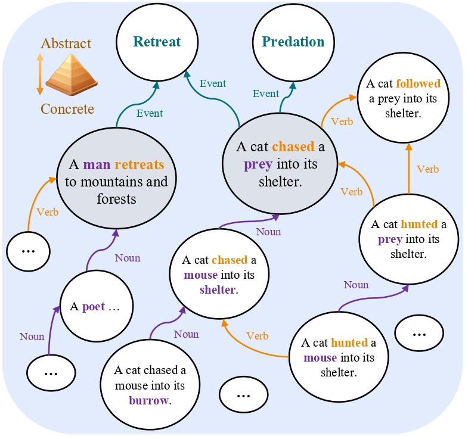

# AbsPyramid: Benchmarking the Abstraction Ability of Language Models with a Unified Entailment Graph

This repository is the official implementation of 
[AbsPyramid: Benchmarking the Abstraction Ability of Language Models with a Unified Entailment Graph](https://arxiv.org/abs/2311.09174).

<div align="center">
    
    <span>An illustration of our AbsPyramid benchmark.</span>
</div>


## Requirements
Python version is 3.8.5

requirements:
```setup
bert_score==0.3.13
datasets==2.13.1
evaluate==0.4.1
llmtuner==0.2.3
numpy==1.24.4
pandas==2.0.3
peft==0.5.0
rouge_score==0.1.2
scikit_learn==1.3.0
torch==2.0.1
transformers==4.34.0
```
You can install all requirements with the command
```
pip install -r requirements.txt
```

## Datasets
### AbsPyramid
We build the AbsPyramid benchmark with two tasks: abstraction detection and abstraction generation.
There data are released on [HuggingFace]()
Data Format: 
### Other sources
We also conduct experiments on Levy/Holt dataset and AbstractATOMIC dataset.
The original links: [Levy/Holt dataset]() and [AbstractATOMIC]()
To be consistent for loading data, we also transform their datasets into the format of
our dataset.

## Training Models
### Models for Abstraction Detection
The scripts to fine-tune language models: 

1. If you want to fine-tune pretrained language models, such as BERT, RoBERTa, and DeBERTa,
the code is in ```PLM_FT_main.py```. The shell script ```shell_script/run_PLM_FT.sh``` sets
most parameters for you. We include commands to call the shell script in ```shell_script/command.sh```.
2. If you want to fine-tune LLMs with LoRA, such as Llama2 (13B), 
the code is in ```LLM_LORA_FP16.py```. The shell script ```shell_script/run_LLM_LORA.sh``` sets
most parameters for you. We include commands to call the shell script in ```shell_script/command.sh```.
3. If you want to test NLI models in zero-shot setup, such as BART-large-mnli, 
the code is in ```NLI_ZERO_SHOT.py```. The shell script ```shell_script/run_NLI_ZERO.sh``` sets
most parameters for you. We include commands to call the shell script in ```shell_script/command.sh```.
4. If you want to fine-tune NLI models, such as BART-large-mnli, 
the code is in ```NLI_FT_main.py```. The shell script ```shell_script/run_NLI_FT.sh``` sets
most parameters for you. We include commands to call the shell script in ```shell_script/command.sh```.

### Models for Abstraction Generation
If you want to train models to generate abstract concepts, the code is in
```generator_main.py```. We provide shell scripts for training and inference of 
generation models in ```shell_script/run_gen_LLM.sh``` and 
```shell_script/run_gen_LLM_inference.sh```. Also, commands to call those
scripts are shown in ```shell_script/command.sh```

## Contributing
If you find any typo or bug, please open an issue.
This repo is maintained by [Zhaowei Wang](https://zhaowei-wang-nlp.github.io/)